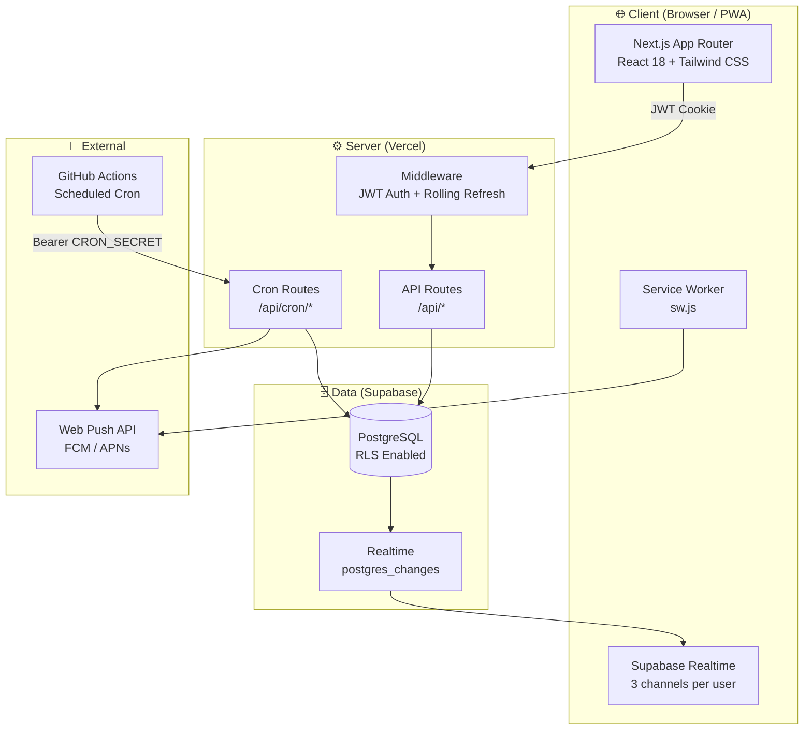
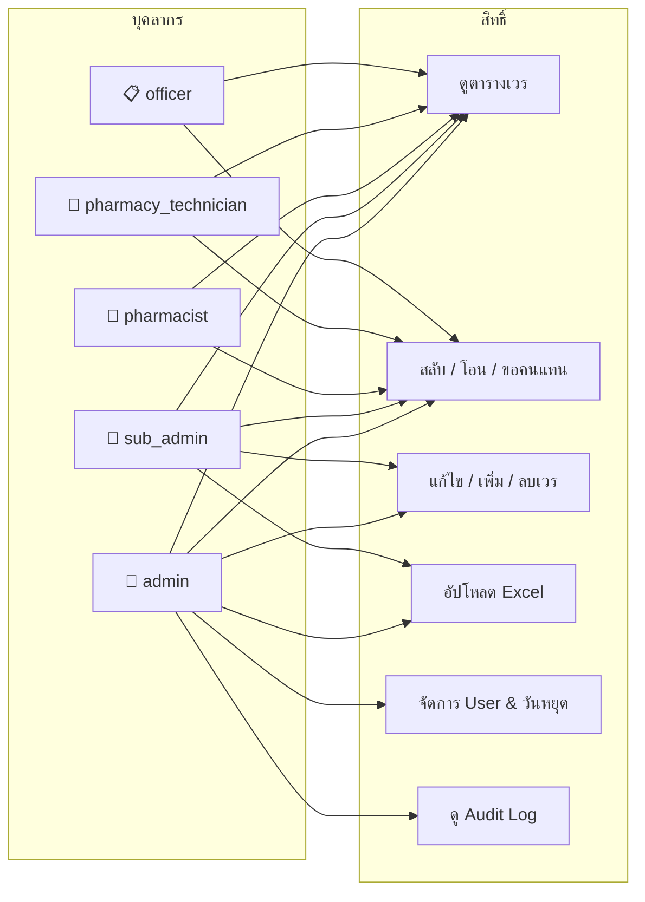
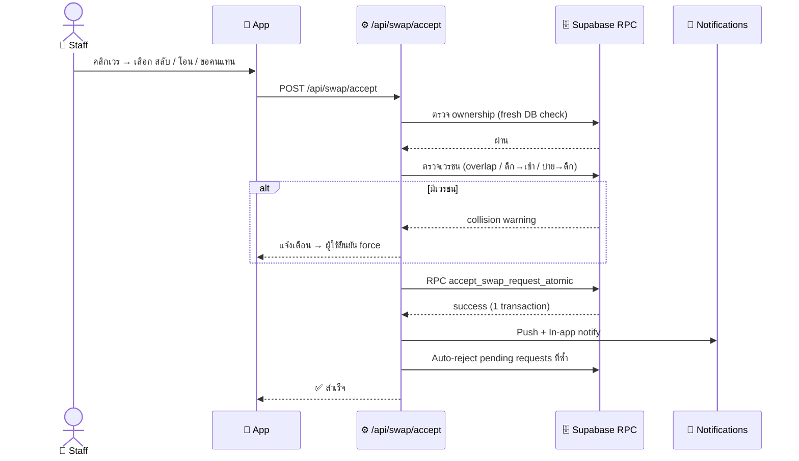
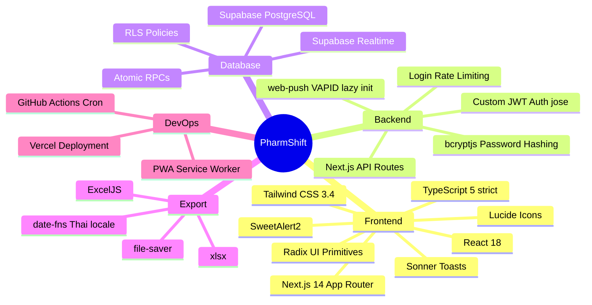
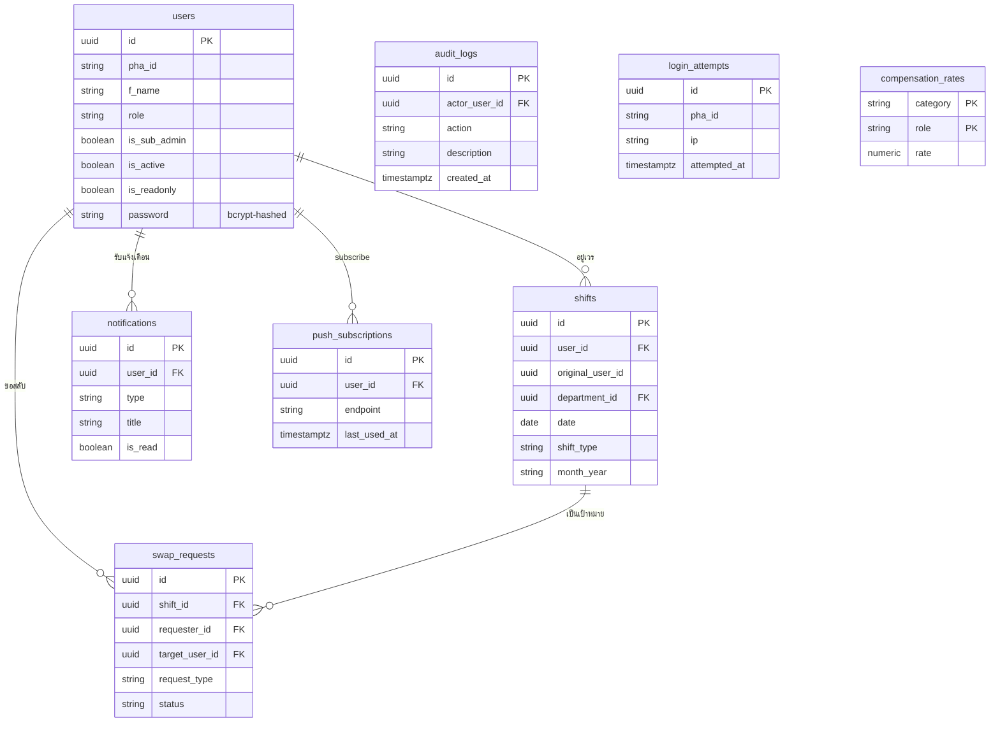

<div align="center">

# 💊 PharmShift · เวรดี๊ดี

**ระบบจัดตารางเวรเภสัชกรรม โรงพยาบาลอุตรดิตถ์**


Progressive Web App สำหรับจัดการตารางเวรเภสัชกรรม รองรับ 3 กลุ่มบุคลากร  
พร้อมระบบสลับเวร, แจ้งเตือน Push, และ Export Excel ครบครัน

</div>

---

## ✨ Features

| Feature | รายละเอียด |
|---|---|
| 📅 **ตารางเวรรายเดือน** | 3 กลุ่มบุคลากร: เภสัชกร, เจ้าพนักงานเภสัชกรรม, เจ้าหน้าที่ |
| 🔄 **สลับ / โอน / ขอคนแทน** | ตรวจเวรชน, atomic accept, auto-reject คำขอซ้ำ |
| 🔔 **Push Notifications** | แจ้งเตือนเช้า / เย็น / ก่อนเวรดึก + In-app notification panel |
| 📊 **Excel Export** | ตารางเวร, หลักฐานการปฏิบัติงาน, ค่าตอบแทน, ใบลงชื่อ |
| 📤 **Excel Import** | อัปโหลดตารางเวรแบบ Bulk (≤ 3 MB) + overwrite mode (ยืนยันรหัสผ่าน admin) |
| 👤 **Admin Tools** | จัดการ User, วันหยุด, Publish/Unpublish, อัตราค่าตอบแทน, Audit Log, Backup |
| 🔐 **Auth ปลอดภัย** | JWT 30 วัน + rolling refresh, bcrypt hash, rate-limit login, cookie `sameSite=strict` |
| 📱 **PWA** | ติดตั้งบน Android / iOS ได้ รองรับ swipe เปลี่ยนเดือน |

---

## 🏗️ Architecture



---

## 👥 User Roles & Permissions



---

## 🔄 Swap / Transfer / Cover Flow



---

## 🛠️ Tech Stack



---

## 📁 Project Structure

```
pharmshift/
├── app/
│   ├── api/
│   │   ├── auth/           # login · logout · me · change-password · verify-password
│   │   ├── admin/
│   │   │   ├── shifts/     # GET · PUT · DELETE · PATCH · /batch · /owners
│   │   │   ├── users/      # GET · POST · PUT · /reset-password
│   │   │   ├── compensation-rates/  # GET · PUT (admin only)
│   │   │   └── audit-logs/ # GET cursor-paginated
│   │   ├── swap/accept/    # atomic swap/transfer/cover
│   │   ├── push/           # subscribe · send (auth + rate-limited)
│   │   ├── notifications/  # GET · POST · PUT(mark-read)
│   │   ├── holidays/       # CRUD · import (JSON body)
│   │   ├── shifts/upload/  # Excel import (≤ 3 MB)
│   │   ├── user/profile/   # self-update
│   │   ├── audit-log/      # POST (bulk client events)
│   │   └── cron/           # shift-reminders (morning/evening/night) · cleanup
│   ├── calendar/           # Main page (~830 LOC)
│   ├── login/
│   └── change-password/
├── components/
│   ├── calendar/           # Grids, modals, export buttons
│   ├── swap/               # SwapModal, NotificationsPanel
│   └── layout/             # Header, MobileBottomNav
├── hooks/
│   ├── useShifts.ts        # useShifts + useSwapRequests + useNotifications
│   ├── useIsMobile.ts
│   └── useSwipeGesture.ts
├── lib/
│   ├── session.ts          # JWT sign/verify/cookie (sameSite=strict, 30d rolling)
│   ├── password.ts         # bcrypt hash/verify + auto-rehash helper
│   ├── pushSender.ts       # Server-side Web Push (lazy VAPID + concurrency cap)
│   ├── compensation.ts     # Rate categories + DB-backed rates loader
│   ├── excelExport.ts      # Evidence + Compensation (5 sheets)
│   ├── scheduleTableExport.ts
│   ├── signSheetExport.ts  # 7 shift configs
│   ├── shiftSlotRules.ts   # Slot validation (เช่น MED บ่าย ห้ามซ้อน)
│   └── types.ts            # Domain types + role helpers
├── supabase/migrations/    # SQL schema + RPC functions
├── public/
│   ├── manifest.json       # PWA (เวรดี๊ดี · theme #8b5cf6)
│   └── sw.js               # Service Worker
└── .github/workflows/
    └── cron.yml            # GitHub Actions (Bangkok timezone)
```

---

## 🗄️ Database Schema



---

## ⏰ Shift Types

| เวร | เวลา | สี |
|---|---|---|
| 🌅 เช้า | 08:30 – 16:30 | `bg-teal-50 border-teal-300` |
| 🌆 บ่าย | 16:30 – 23:59 | `bg-purple-50 border-purple-300` |
| 🌙 ดึก | 00:00 – 08:30 | `bg-indigo-50 border-indigo-300` |
| 🌄 รุ่งอรุณ | 07:00 – 08:30 | `bg-amber-50 border-amber-300` |
| 🏥 smc | 16:30 – 20:30 | `bg-violet-100 border-violet-300` |

---

## 🚀 Quick Start

### Requirements
- Node.js 18.17+
- Supabase project (หรือ local Supabase CLI)
- VAPID keys (สำหรับ Push Notifications)

### Installation

```bash
git clone https://github.com/codex074/utth-shift.git
cd utth-shift
npm install
```

### Environment Variables

สร้างไฟล์ `.env.local`:

```bash
# Supabase
NEXT_PUBLIC_SUPABASE_URL=https://your-project.supabase.co
NEXT_PUBLIC_SUPABASE_ANON_KEY=your-anon-key
SUPABASE_SERVICE_ROLE_KEY=your-service-role-key

# Session JWT (server-only — ห้าม NEXT_PUBLIC_)
SESSION_JWT_SECRET=      # openssl rand -base64 64

# Web Push VAPID
NEXT_PUBLIC_VAPID_PUBLIC_KEY=your-vapid-public-key
VAPID_PRIVATE_KEY=your-vapid-private-key
VAPID_SUBJECT=mailto:pharmacy@hospital.go.th

# Cron
CRON_SECRET=change-me
NEXT_PUBLIC_APP_URL=http://localhost:3000
```

```bash
# Generate VAPID keys
npx web-push generate-vapid-keys
```

### Run

```bash
npm run dev      # http://localhost:3000
npm run build    # production build
npm run lint     # ESLint
```

---

## 🌐 Deployment

### Vercel
1. Connect repository → Vercel
2. ตั้งค่า Environment Variables ทั้งหมด — โดยเฉพาะ `SESSION_JWT_SECRET` (generate ด้วย `openssl rand -base64 64`)
3. `vercel.json` ตั้ง `maxDuration: 60` สำหรับ cron routes (`app/api/cron/**`)
4. รัน Supabase migrations ทั้งหมดใน `supabase/migrations/` — โดยเฉพาะ
   - `20260530_create_login_attempts.sql` — เปิด rate-limit login
   - `20260530_hash_existing_user_passwords.sql` — hash plain-text passwords ที่ค้างอยู่
   - `20260530_create_compensation_rates.sql` — ตารางอัตราค่าตอบแทน
   - `20260530_push_subscriptions_last_used_at.sql` — กัน cleanup ลบ device ที่ยังใช้งาน

### GitHub Actions Cron (runner เดียว — Vercel cron ถูกถอดออก)

| UTC | Bangkok | Job | Endpoint |
|---|---|---|---|
| 23:00 | 06:00 | Morning reminders — เวรวันนี้ (ยกเว้นรุ่งอรุณ) | `/api/cron/shift-reminders?run=morning` |
| 09:00 | 16:00 | Evening reminders — เวรพรุ่งนี้ (ทุกประเภท) | `/api/cron/shift-reminders?run=evening` |
| 09:00 | 16:00 | Night reminders — เวรดึกคืนนี้ | `/api/cron/shift-reminders?run=night` |
| 21:00 | 04:00 | Cleanup — swap, notifications, audit, push (≥ 3 mo / 12 h / 3 d) | `/api/cron/cleanup` |

Secrets ที่ต้องตั้งใน GitHub repository:
- `APP_URL` — deployed app URL
- `CRON_SECRET` — same as env variable (fail-closed: ถ้าไม่ตั้ง cron route ตอบ 500)

---

## 📜 License & Credits

© 2026 **Ph.D. Teeradet Wichai**  
Pharmacy Department, Uttaradit Hospital

All rights reserved. This software is developed for internal use by the Pharmacy Department, Uttaradit Hospital. Unauthorized reproduction or distribution is prohibited.

Built with the assistance of [Claude](https://claude.ai) (Anthropic) and [Codex](https://openai.com/codex) (OpenAI).
